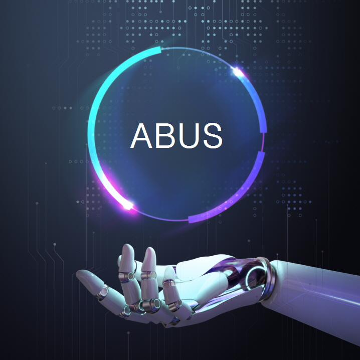

# Kara-Audio

🌍 [한국어](README.kor.md) ∙ [English](README.eng.md) ∙ [中文简体](README.zh.md) ∙ [中文繁體](README.tw.md) ∙ [日本語](README.jpn.md)

[](LICENSE)
[](https://github.com/abus-aikorea/kara-audio/releases)

使用demucs和mdx-net的最佳人声移除gradio网页界面。
使用faster whisper自动创建字幕。轻松一键安装。完全便携。

### 运行示例

https://github.com/abus-aikorea/kara-audio/assets/161691694/40bdc7d6-6924-4711-b3aa-b0af3ea29c38


## 简介
Kara-Audio是AI Studio的新名称。自2024-04-10起。

* Kara-Audio将YouTube视频转换成您自己的**卡拉OK音乐视频**。
* 您可以创建**文字记录**、**会议纪要**以及电影、电视剧和新闻的**字幕**。
* 它配备了UVR5提供的**人声移除**和使用OpenAI Whisper的**自动字幕**功能。
* Kara-Audio可以**一键**轻松安装，并提供Gradio网页界面。

# 主要功能

  * `Kara Audio` 标签页
      - YouTube下载器、人声移除、自动字幕集成环境

[这里会显示一张主页面的图片，但在文本翻译中无法直接嵌入]

  * `Demixing` 标签页
    - 人声分离、混响/回音去除
    - 支持MDX-Net、Demucs模型
    - 支持3种音频输出格式（wav、flac、mp3）

  * `Subtitle` 标签页
    - 语音识别、自动字幕（srt、vtt、txt）
    - 支持90多种语言（英语、日语、法语、德语、中文、韩语）

## 主要特性
* 您可以下载YouTube视频（mp4、webm）并将其保存为音频文件（mp3、wav、flac）。
* 我们提供人声移除功能。使用**MDX-Net**和**Demucs**。
* 通过AI语音识别可以实现自动字幕创建。它使用OpenAI的高性能语音识别引擎**Whisper**。
* Whisper支持90多种语言，包括日语、韩语、英语、中文、法语和西班牙语。
* **一键安装**。安装后，您可以**永久**免费使用。（※ 免费版本有**30分钟**使用时间限制）
* 提供**网页界面**。推荐使用Google Chrome浏览器。

## 运行环境
* 操作系统：Windows 10/11（64位） **※ 不支持Linux和Mac OS**
* CPU：Intel处理器2GHz或更快（或同等兼容处理器）
* 内存：16GB或更高
* 硬盘：安装时至少需要20GB可用空间
* GPU：推荐支持CUDA 12.3的NVIDIA显卡。6GB或更高VRAM。
* 需要互联网连接（安装时）

## 安装和运行

### 第1步. 准备安装包
* A. 付费版
    + 将USB中包含的压缩文件（**kara-audio-x.zip**）解压到计算机上适当的位置。
    + 或者，将已解压的文件夹（**kara-audio-x**）复制到计算机上适当的位置。

* B. 免费版
  + 从[](https://github.com/abus-aikorea/kara-audio/releases)下载并解压最新版本（**Source code (zip)**）
  + 或者，使用git clone下载源代码

```bash
git clone https://github.com/abus-aikorea/kara-audio.git
```

### 第2步. 如何安装和运行

0. 安装前
   - 运行Windows Update，将系统更新到最新状态。
   - 将NVIDIA显卡驱动更新到最新状态。

1. 运行`configure.bat`
     * 在Windows上安装ffmpeg和CUDA（如果使用NVIDIA GPU）以及Windows SDK。
     * 安装需要互联网连接，根据计算机配置可能需要一个多小时。
     * 安装过程中切勿关闭Windows命令窗口。（如果操作似乎停止，请偶尔按空格键）
     * 如果安装过程中出现错误，建议运行uninstall.bat并从头开始。
     * configure.bat只需运行一次。

2. 运行`start.bat`
     * 启动Kara-Audio。网页界面将自动运行。
     * 首次运行时，先安装Kara-Audio。
     * 安装需要互联网连接，根据计算机配置可能需要一个多小时。
     * 安装过程中切勿关闭Windows命令窗口。（如果操作似乎停止，请偶尔按空格键）
     * 如果安装过程中出现错误，请删除installer_files文件夹并重新运行start.bat。

    #### 当浏览器不自动运行时
     * 关闭Windows命令窗口并重新运行start.bat，或者
     * 直接运行浏览器，并在地址栏中输入Windows命令窗口显示的地址（例如 **http://127.0.0.1:7894** ）。

### 第3步. 如何卸载
* 运行`uninstall.bat`
  * 删除installer_files。
  * 删除在Windows上安装的ffmpeg、CUDA包和Windows SDK（如果选择）

* Kara-Audio默认为**便携式**安装。要卸载程序，只需删除安装文件夹即可。

## 使用技巧

1. 关于Demixer
   - Facebook Research的Demucs模型（htdemucs、htdemucs_6s、htdemucs_ft、mdx_extra）都表现良好。
   - Demucs即使在低端电脑（8GB内存）上也运行得相当好。
   - 在MDX-Net中，UVR-MDX-NET-Voc_FT、Kim_Vocal_2、UVR_MDXNET_KARA_2等表现良好。
   - MDX-Net模型只能在高端电脑（16GB或更高内存）上运行。
   - 尝试一个个使用这些模型，找到适合您目的的模型。
   - 我们建议使用最新的NVIDIA GPU（6GB或更高VRAM）。如果VRAM不足，可能会出现内存不足错误。

2. 关于Whisper
   - Large-V2模型最佳。其他模型识别率较差。
   - 如果音频语言是"韩语"，最好也将Whisper语言设置为"韩语"。
   - 当音频语言是"韩语"时，如果将Whisper语言设置为"日语"，会输出"日语"，但准确度会很低。（Google翻译更好。）
   - **Denoise**选项使用MDX-Net模型去除噪音。可能会改善语音识别结果。（仅在高端电脑上使用）

## 注意事项
当Windows Defender误将批处理文件识别为特洛伊木马时，这通常被称为"误报"。要解决这个问题，您可以通过以下步骤：

1. 文件例外处理：在Windows Defender中，您可以设置某些文件或进程跳过安全扫描。操作如下：
   * 点击"开始"按钮，进入"设置"。
   * 点击"更新和安全"。
   * 选择"Windows安全中心"，进入"病毒和威胁防护"。
   * 点击"管理病毒和威胁防护设置"。
   * 在"病毒和威胁防护设置"中选择"添加或删除排除项"。
   * 选择"文件或文件夹"，找到相关的批处理文件并将其添加为例外。
2. 临时禁用Windows Defender：这可能是一个临时解决方案。但是，使用此方法时必须小心，因为它可能会使您的计算机暴露于其他威胁。
3. 向防病毒软件报告问题：如果您确定该文件不是特洛伊木马，可以将其报告给Microsoft作为误报。Microsoft将审核并采取必要的行动。

## 联系我们
* 电子邮件：<abus.aikorea@gmail.com>
* 主页（韩语）：<https://slashpage.com/abus>
* 네이버 스마트스토어（韩语）：<https://smartstore.naver.com/abus/category/ALL?cp=1>
* Coupang（韩语）：<https://www.coupang.com/vp/products/7875503674>
* Amazon（美国）：<https://www.amazon.com/dp/B0CTQQDPXT>
* Amazon（日本）：<https://www.amazon.co.jp/dp/B0CTHT2JH3>

## YouTube
* 产品信息：<https://youtu.be/heEN4UIQLjc>
* 自动字幕∙翻译：<https://youtu.be/uQ14hoEiI4c?si=Io9K_vIDYyeu9Z8_>
* 家庭卡拉OK：<https://youtube.com/playlist?list=PLwx5dnMDVC9bVxfGo58U-R-w3fUHqwiD6&si=TZBh5AFjcr7_dyiI>

## 鸣谢
* UVR5：<https://github.com/Anjok07/ultimatevocalremovergui>
* FacebookResearch Demucs：<https://github.com/facebookresearch/demucs>
* OpenAI Whisper：<https://github.com/openai/whisper>
* Faster-Whisper：<https://github.com/SYSTRAN/faster-whisper>
* yt-dlp：<https://github.com/yt-dlp/yt-dlp>
* gradio：<https://github.com/gradio-app/gradio>

## 版权
 by [ABUS](https://slashpage.com/abus)
